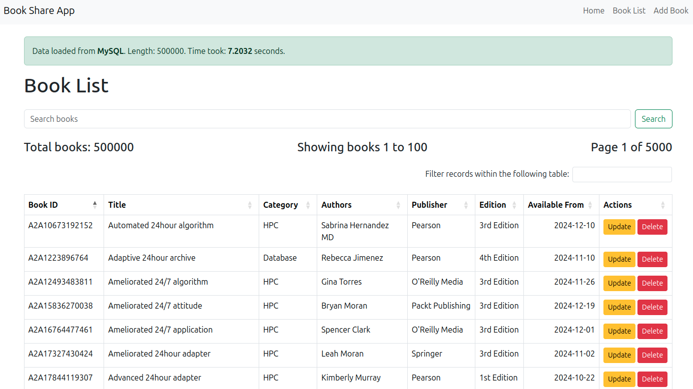

# Book Share Application

This app demonstrates how caching with **Redis** can significantly improve the performance of a **Flask** web application backed by **MySQL**. The application uses **Flask-Caching** and **PyMySQL** to interact with the database and cache the query results in Redis, effectively reducing the response time for subsequent queries.

The application contains a single `books` table with 500k rows. Without caching, fetching all rows from MySQL takes approximately **7 seconds**. By using Redis caching, the same query retrieves the data in around **1 second**.

## Tech Stack

- **Flask**: Flask is a minimalistic Python framework that provides essential components for building web applications. In this project, Flask handles routing, request processing, and rendering templates.
- **MySQL**: The relational database system that stores the book data.
- **PyMySQL**: A MySQL client library for Python.
- **Redis**: Redis is an in-memory data store, often used as a cache. It improves performance by allowing frequently accessed data to be stored and retrieved quickly without querying the database.
- **Flask-Caching, redis**: Flask extensions that provide caching support for Flask using Redis. It supports various backends like Redis and improves performance by caching expensive or repetitive operations.
- **Bootstrap 5, datatables**: Bootstrap 5 CSS framework is used for responsive styling and layout in the application, providing pre-designed components like navigation bars, pagination, and alerts. DataTables is integrated for efficient table management, offering features like search, and sorting for large datasets in a user-friendly interface. 


## Functionalities
The Book Share app is a straightforward CRUD (Create, Read, Update, Delete) application offering the following key functionalities:

- **Add a New Book**: Allows users to add a new book to the MySQL database.
- **Update an Existing Book**: Users can modify the details of an existing book.
- **Delete a Book**: Provides the ability to remove a book from the database.
- **Show Books with Pagination and Caching**: Displays the list of books with pagination and caching for easy navigation through large datasets.
- **Search for a Book**: Users can search for books by ID, title, or any string field to quickly find relevant entries.

Flowchart for **Show Books with Pagination and Caching**:

```mermaid
flowchart TD
    A[User Request with Page Number] --> B{Data in Redis Cache?}
    
    %% Yes path
    B -->|Yes| C[Access Redis Cache]
    
    %% No path
    B -->|No| D[Query MySQL Database]
    D --> E[Store Full Dataset in Redis Cache]
    
    %% Common pagination logic
    C --> F["Calculate Pagination:\nstart = (page - 1) * 100\nend = page * 100"]
    E --> F
    F --> G["Return Response:\n1. Sliced Data (100 books)\n2. Total Pages List"]
```

[//]: # (![Show Books with Pagination and Caching]&#40;screenshots/flow.png&#41;)


## Local setup

### Dependencies

- Python 3.8+
- MySQL server 8+
- Redis

### Install Redis (Ubuntu)
Install Redis for your Operating system using the [Redis docs](https://redis.io/docs/latest/operate/oss_and_stack/install/install-redis/).
To install Redis on an Ubuntu system, use the following steps:
```shell
sudo apt-get install lsb-release curl gpg
curl -fsSL https://packages.redis.io/gpg | sudo gpg --dearmor -o /usr/share/keyrings/redis-archive-keyring.gpg
sudo chmod 644 /usr/share/keyrings/redis-archive-keyring.gpg
echo "deb [signed-by=/usr/share/keyrings/redis-archive-keyring.gpg] https://packages.redis.io/deb $(lsb_release -cs) main" | sudo tee /etc/apt/sources.list.d/redis.list
sudo apt-get update
sudo apt-get install redis
```

- Check if Redis is installed correctly by running:

```shell
redis-cli ping
# you should get back
PONG
```

- Start Redis server if it is not running:

```shell
redis-server
```

### Setting up Python Environment and Installing Packages

- Create and activate a Python virtual environment (Linux)

```shell
python3 -m venv venv
source venv/bin/activate
```

- Create and activate a Python virtual environment (Windows)

```shell
python -m venv venv
venv\Scripts\activate
```

- Install required Python packages

```shell
pip install flask PyMySQL python-dotenv faker Flask-Caching redis cryptography
```

Alternatively, you can install all the Python packages from the [requirements.txt](requirements.txt)

```shell
pip install -r requirements.txt
```

### Setting up MySQL and Importing Data
- Import the initial database setup which contains 500k rows:
```shell
mysql -u root -p<book_share_db.sql
```
- Update the [.flaskenv](.flaskenv) file with your MySQL database user and password.

### Running the Flask App
After setting up the database and Redis, start the Flask application:
```shell
flask run
```
The app will run at [http://127.0.0.1:5000](http://127.0.0.1:5000).

### (Optional) data generator utility and clearing Redis cache
- Use the [data_generator.py](data_generator.py) script to create a custom-sized table.
```shell
python data_generator.py --rows 500000
```
You can adjust the number of rows by changing the value of `--rows` as needed. 
It uses Faker package to generate the SQL file with realistic data.
- Clear Redis cache:
```shell
redis-cli
flushall
```
## Demonstration

Retrieval time from MySQL:



Retrieval time from Redis cache:


### References

- [Flask docs](https://flask.palletsprojects.com/en/3.0.x/quickstart/)
- [PyMSQL docs](https://pymysql.readthedocs.io/en/latest/user/installation.html)
- [Datatable docs](https://datatables.net/download/index)
- [Redis installation docs](https://redis.io/docs/latest/operate/oss_and_stack/install/install-redis/)
- [Flask caching docs](https://flask-caching.readthedocs.io/en/latest/)